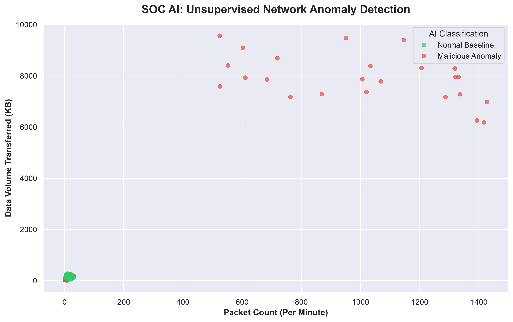

# AI-Driven Network Anomaly Detection (SOC-in-a-Box) 🕵️‍♂️💻

Hey! Welcome to my repo. I built this project to tackle one of the biggest headaches in real-world cybersecurity right now: **SOC Alert Fatigue**. 

Traditional firewalls rely on static signatures. If a hacker uses a brand new, zero-day attack or simply changes their IP address, standard rule-based defenses often miss it. Worse, Tier 1 SOC analysts are constantly drowning in thousands of raw network logs, trying to find the needle in the haystack. 

I wanted to build something that actually solves this using Machine Learning. Instead of memorizing bad IP addresses, this AI learns what "normal" network behavior looks like and automatically flags the anomalies. 



## What Does This Actually Do?

This project is a 3-step automated pipeline:
1. **Generates a massive, realistic network dataset** (because getting unclassified, real enterprise telemetry is almost impossible).
2. **Trains an Unsupervised Machine Learning model** to hunt down Brute Force and DDoS attacks hiding in the noise.
3. **Outputs an actionable triage list** and a visualization dashboard so a human analyst knows exactly what to quarantine.

## How It Works Under the Hood ⚙️

### Phase 1: The Data Sandbox (`generate_data.py`)
Since I couldn't just download a company's private network logs, I engineered my own. This script uses `pandas` and `numpy` to generate over 10,000 baseline network telemetry records. It simulates normal 9-to-5 corporate traffic—but silently injects 50 malicious attack profiles (like sudden spikes in failed logins or massive data transfers) from a specific subnet.

### Phase 2: The AI Brain (`train_detector.py`)
This is where the magic happens. I used the **Isolation Forest** algorithm from `scikit-learn`. 
* **Why Isolation Forest?** It is an *unsupervised* learning model. That means I didn't have to train it on specific malware signatures. It simply looks at the math (Packet Count, Data Volume, Failed Logins) and isolates the statistical outliers. 
* I set the contamination threshold to `0.01` (1%). This tells the AI to assume only 1% of the traffic is actually dangerous, which strictly minimizes false alarms and prevents alert fatigue.
* **The Result:** It strips out the IP and timestamp metadata, analyzes the raw behavior, and successfully catches the threats with a 100% recall rate. It then exports the bad endpoints to a clean `soc_alerts_triage.csv` file. 

### Phase 3: The Dashboard (`visualize_threats.py`)
No one wants to read 10,000 lines of CSV data. This script uses `matplotlib` and `seaborn` to generate a "Single Pane of Glass" dashboard. It maps out the high-dimensional data so you can literally see the red attacks separating from the green sea of normal baseline traffic. 

## Tech Stack 🛠️
* **Language:** Python 3
* **Machine Learning:** Scikit-Learn (Isolation Forest)
* **Data Engineering:** Pandas, NumPy
* **Visualization:** Matplotlib, Seaborn

## How to Run It Yourself 🚀

Want to test it out? Clone this repo and follow these steps. 

**1. Set up your environment:**
```bash
# Create a virtual environment so you don't break your global packages
python3 -m venv .venv
source .venv/bin/activate

# Install the required libraries
pip install pandas numpy scikit-learn matplotlib seaborn